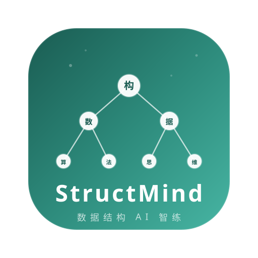

<p align="center">
  
</p>

<h1 align="center">StructMind — 数据结构 AI 智练中心</h1>

<p align="center">
  专为数据结构课程打造的智能刷题平台 · 苏格拉底式 AI 导师 · 个性化学习推荐
</p>

<p align="center">
  
  
  
  <a href="https://beian.miit.gov.cn"></a>
</p>

---

## ✨ 特性

- 📚 **本地题库** — 323 道数据结构期末考试客观题 + 26 道作业题 + 35 道讨论题
- 🤖 **苏格拉底式 AI 导师** — 不直接给答案，通过提问引导思考，真正理解数据结构
- 🎯 **个性化推荐** — 基于用户画像的智能题目推荐，精准打击薄弱知识点
- 📊 **学习画像** — 章节 / 题型掌握度可视化、学习热力图、能力雷达图
- 🔐 **用户系统** — 注册 / 登录、管理员审批、PBKDF2 密码安全加密
- 🏆 **排行榜** — 周榜 / 月榜激励持续学习
- 💬 **社区讨论** — 题目讨论区，发帖、回复、互相交流
- 📖 **错题本** — 自动收集错题，支持重做和 AI 解析
- 📱 **响应式 Web** — 桌面 + 移动端一套自适应界面，桌面优先
- 🎨 **现代 UI** — 中性极简设计、清晰的信息层级、细腻的微交互

## 🚀 快速开始

### 环境要求

- Python 3.11+
- （可选）DeepSeek 或智谱 AI 的 API Key — 用于 AI 功能

### 本地运行

```bash
# 克隆项目
git clone https://github.com/ustinian-T/StructMind.git
cd StructMind

# 启动后端服务
python server.py
```

浏览器打开 `http://localhost:8765` 即可使用。

### 配置用户 AI 模型

uniCloud 电脑 Web 是唯一用户端。用户登录后在「我的 AI 模型」中独立填写自己的 API Key，并可选择以下五个模型：

- `MiniMax-M3[1M]`
- `deepseek-v4-flash`
- `deepseek-v4-pro[1m]`
- `ark-code-latest`
- `step-router-v1`

密钥使用 AES-256-GCM 按用户加密保存到 `structmind_user_ai_configs`，前端只会收到配置状态和脱敏尾号。服务端固定模型端点，不接受用户填写 Base URL。原有 `DEEPSEEK_API_KEY` 等环境变量只用于本地 FastAPI 开发回退，不参与 uniCloud 生产用户调用。

```bash
# Linux / Mac
export DEEPSEEK_API_KEY="你的 DeepSeek API Key"
python server.py
```

支持的模型：
- 智谱 AI：`glm-5.1`、`glm-5`、`glm-4.7-flash`
- DeepSeek：`deepseek-v4-flash`、`deepseek-v4-pro`

### 统一 Agent 核心

Tutor 的唯一执行核心位于 FastAPI：`TurnContext → TutorOrchestrator → AsyncModelGateway`。Web 的 REST、SSE、WebSocket，以及 uni-app 经 uniCloud 转发的请求，统一返回 `structmind.agent.v1` 事件协议。主要事件为 `meta`、`route`、`delta`、`tool_start`、`tool_result`、`usage`、`done`、`error`；`delta.content` 是唯一文本增量字段。

可配置的硬预算：

```bash
SM_AGENT_MAX_TOOL_ROUNDS=2
SM_AGENT_MAX_OUTPUT_TOKENS=1200
SM_AGENT_TIMEOUT_SECONDS=45
SM_AGENT_MAX_HISTORY_MESSAGES=12
```

uniCloud 不保存 Tutor Prompt，Tutor 仍由 FastAPI Agent 核心执行。部署时必须在 FastAPI 和 `structmind-ai` 云函数中配置同一高强度 `SM_AGENT_SERVICE_KEY` 与 `SM_AGENT_CREDENTIAL_KEY`，并在云函数配置 FastAPI 地址。`SM_AGENT_CREDENTIAL_KEY` 用于加密最长 60 秒、单次使用的用户模型凭据封套：

```bash
SM_AGENT_CORE_URL=https://your-fastapi.example.com
SM_AGENT_SERVICE_KEY=使用密码管理器生成的随机服务凭据
SM_AGENT_CREDENTIAL_KEY=Base64编码的32字节随机密钥
```

仅在 `structmind-ai` 云函数中配置另一把不同的主密钥：

```bash
SM_USER_AI_MASTER_KEY=Base64编码的32字节随机密钥
```

部署顺序：上传 `structmind_user_ai_configs.schema.json` 和同名 `.index.json`，配置上述云函数变量，部署 FastAPI Agent 核心，再部署 `structmind-ai` 与 `api` 云函数，最后重新编译并上传 uni-app H5。

`/api/internal/agent/tutor` 仅接受 `X-StructMind-Service-Key`，不会开放本地用户画像工具；Web 用户入口仍使用 Bearer 会话认证和个人 AI 额度。

### Docker 部署

```bash
docker build -t structmind .
docker run -p 8765:8765 -e DEEPSEEK_API_KEY="your-key" structmind
```

## 🔑 管理员账号

仅在显式设置 `SM_ADMIN_PASSWORD` 后，首次启动时自动创建或修复管理员：

| 账号 | 密码 |
|------|------|
| `SM_ADMIN_ACCOUNT`（默认 `tanshuhong`） | `SM_ADMIN_PASSWORD` 环境变量中的值 |

> 项目不提供默认管理员密码。启动前必须显式设置：
> ```bash
> export SM_ADMIN_PASSWORD="你的强密码"
> ```

## 📂 项目结构

```
StructMind/
├── server.py                     # Python 后端（HTTP API 服务）
├── web/                          # FastAPI Web 工作台（不会被 uni-app 复制进 H5）
│   ├── index.html
│   ├── app.js                    # 主逻辑（渲染、状态、流式 AI 对话）
│   └── styles.css                # 浅绿色学习工作台设计系统
├── static/                       # 跨端公共资源，仅存放 Logo、TabBar 图标等资产
├── pages/                        # uni-app 页面（uniCloud 网站的唯一前端入口）
├── src/agents/                   # 统一 TutorOrchestrator、TurnContext 与事件协议
├── src/ai/gateway.py             # OpenAI 兼容的异步流式模型网关
├── uniCloud-aliyun/              # uniCloud 云服务（后端代理层）
│   ├── cloudfunctions/           # 云函数；Tutor 仅作为带服务凭据的 FastAPI 代理
│   └── database/                 # DB Schema（权限配置）
├── tests/
│   └── test_core.py              # 核心功能单元测试
├── runtime/                      # 运行时数据
├── nginx.conf                    # Nginx 反向代理
└── Dockerfile                    # Docker 构建
```

## 🔌 API 接口

### 用户认证
| 方法 | 路径 | 说明 |
|------|------|------|
| POST | `/api/auth/register` | 注册（需管理员审批） |
| POST | `/api/auth/login` | 登录 |
| POST | `/api/auth/logout` | 退出 |
| GET | `/api/auth/me` | 当前用户 |

### 管理员
| 方法 | 路径 | 说明 |
|------|------|------|
| GET | `/api/admin/pending` | 待审批列表 |
| GET | `/api/admin/users` | 全部用户 |
| POST | `/api/admin/approve` | 审批用户 |

### 练习
| 方法 | 路径 | 说明 |
|------|------|------|
| POST | `/api/session` | 创建练习（顺序 / 随机 / 错题） |
| POST | `/api/answer` | 提交答案（自动批改） |
| GET | `/api/questions` | 题目列表 |
| GET | `/api/wrong` | 错题本 |
| POST | `/api/recommend/questions` | 个性化推荐 |

### AI
| 方法 | 路径 | 说明 |
|------|------|------|
| POST | `/api/ai/generate` | AI 生成变式题 |
| POST | `/api/ai/answer` | AI 题批改 |
| POST | `/api/ai/tutor` | 苏格拉底式 AI 答疑 |
| POST | `/api/ai/tutor/stream` | 同协议 SSE 逐 Token 答疑 |
| WS | `/ws/tutor` | 同协议 WebSocket 逐 Token 答疑 |
| POST | `/api/internal/agent/tutor` | uniCloud 服务凭据代理入口 |
| POST | `/api/question/ai/stream` | 题目 AI 讲解（流式） |

### 社区 & 排行
| 方法 | 路径 | 说明 |
|------|------|------|
| POST | `/api/community/post` | 发帖 |
| GET | `/api/community/posts` | 帖子列表 |
| POST | `/api/community/reply` | 回复 |
| GET | `/api/leaderboard` | 排行榜（?period=week\|month） |

### 学习报告
| 方法 | 路径 | 说明 |
|------|------|------|
| GET | `/api/report/pdf` | 生成学习报告 |
| POST | `/api/learning/generate-plan` | 生成学习计划 |
| GET | `/api/learning/plan` | 查看学习计划 |

## 🧪 测试

```bash
python -m pytest tests/test_core.py -v
```

## 🛠️ 技术栈

| 层级 | 技术 |
|------|------|
| 后端 | Python 3.11+, SQLite |
| Web 前端 | Vanilla JS (ES2020+), CSS 变量 + 响应式布局 |
| 云服务 | uniCloud (阿里云，可选代理层) |
| AI | DeepSeek / 智谱 AI API |
| 安全 | PBKDF2-SHA256, 速率限制, CORS, CSP |
| 部署 | Docker, Nginx |

## 📄 许可证

MIT License · Copyright © 2026 StructMind · 谭书宏

<p align="center">
  <a href="https://beian.miit.gov.cn" target="_blank" rel="noopener">湘ICP备2026021754号-2</a>
</p>
